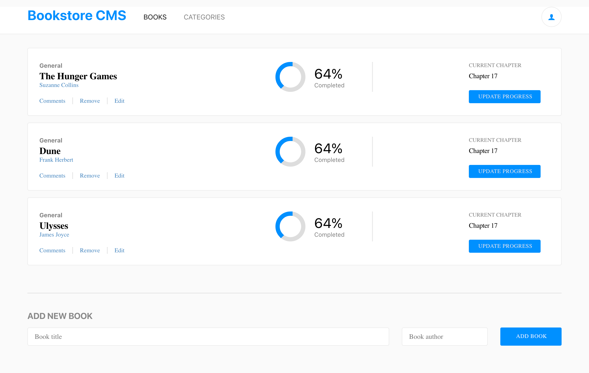

# Book Store

> In this project I build a "Awesome Books" App that allows users to add a book, remove selected book, and display a list of books.
## Screenshot


## Built With

- React
- Redux
- SCSS
- JavaScript
- HTML

## Live Demo

For a live demo
<!-- - Heroku [click here](https://math-magicians-jorge.herokuapp.com/quote).-->
- Netlify [click here](https://isnt-alexr16-awesome.netlify.app/). 

## Getting Started

To get a local copy of the project, follow these steps: 
1. Open the terminal and navigate to the folder where you would like to put these files.
2. Type the following commands into the terminal: 
 ```
 git clone https://github.com/Alexr16/BookStore
 ```
 ```
 cd MathMagicians
 ```
 
## Run project

```bash
$ npm install
$ npm run start # this will make webpack watching for your changes in code
```

### Open page in browser

```bash
$ open dist/index.html
```

## Author

👤 **George**

- GitHub: [@Alexr16](https://github.com/Alexr16)
- Twitter: [@ReveloJ](https://twitter.com/ReveloJ)
- LinkedIn: [Jorge Ríos](https://www.linkedin.com/in/jorge-r%C3%ADos-3b33ab22b)

## 🤝 Contributing

Contributions, issues, and feature requests are welcome!

Feel free to check the [issues page](https://github.com/Alexr16/BookStore/issues).

## Show your support

Give a ⭐️ if you like this project!

## Acknowledgments

- Thanks to my peers who are always there to offer support. 

## 📝 License

This project is [MIT](./LICENSE) licensed.

